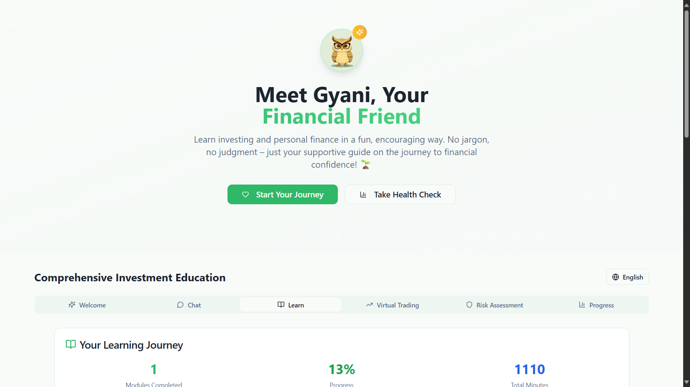

# 🌟 Gyani - Your AI-Powered Financial Education Companion

**Enhancing Retail Investor Education and Engagement**

Gyani is a comprehensive, submission-ready financial education platform that addresses the critical need for accessible investment education in India. Built to solve the problem of retail investors lacking knowledge to navigate securities markets, this platform combines AI-powered guidance with interactive learning, virtual trading, and multilingual support.
### logo

### screenshot


## 🎯 Problem Statement

Many retail investors lack the knowledge to navigate the securities market, leading to poor investment decisions or reliance on unverified advice. Additionally, most online sources of information for retail investors are in English, creating a lack of educative material in various vernacular languages.

## 💡 Solution

Gyani provides:
- **Interactive Education**: Comprehensive modules covering stock market basics to advanced strategies
- **AI-Powered Guidance**: Personalized learning with Gyani, your friendly financial companion
- **Virtual Trading**: Risk-free practice with simulated market data
- **Multilingual Support**: Content available in English, Hindi, and Telugu
- **Risk Assessment**: Personalized investment recommendations based on risk profile
- **Real-time Market Simulation**: Educational market data for hands-on learning

## 🚀 Key Features

### 🤖 AI-Powered Learning Assistant
- **Gyani Chat**: Friendly, encouraging AI companion with personality
- **Multi-Provider Support**: OpenAI GPT-4 and Google Gemini integration with fallbacks
- **Contextual Learning**: Personalized responses based on user's progress
- **Indian Market Focus**: Specialized knowledge of NSE, BSE, SEBI regulations
- **Multilingual Support**: Conversations in English, Hindi, and Telugu

### 📚 Comprehensive Educational Content
- **10 Learning Modules**: From basics to advanced investment strategies
- **Interactive Quizzes**: Knowledge testing with detailed explanations
- **Progress Tracking**: Visual completion statistics and achievements
- **Gamified Learning**: Badges, streaks, and milestone celebrations
- **Official Resources**: Links to SEBI, NSE, BSE educational materials

### 📊 Advanced Assessment Tools
- **Financial Health Check**: 8-category comprehensive assessment
- **Risk Profiling**: Advanced questionnaire with personalized recommendations
- **Portfolio Suggestions**: Asset allocation based on risk tolerance
- **Progress Analytics**: Detailed learning insights and category breakdowns

### 💹 Virtual Trading Platform
- **Real-time Simulation**: Live market data simulation for practice
- **Portfolio Management**: Buy/sell stocks with virtual ₹1,00,000
- **Transaction History**: Complete trading records and performance analytics
- **Watchlist Management**: Track favorite stocks and market movements
- **Performance Metrics**: P&L tracking, win rates, and portfolio analysis

### 🌐 Market Data & News
- **Live Market Simulator**: Real-time price updates for educational purposes
- **Market Indices**: NIFTY 50, SENSEX, sectoral indices with live data
- **News Feed**: Categorized market news with impact analysis
- **Stock Information**: Detailed company data, P/E ratios, market cap

### 🎯 Personalization & Analytics
- **Learning Dashboard**: Comprehensive progress visualization
- **Achievement System**: Gamified learning with badges and rewards
- **Personalized Recommendations**: AI-driven next steps
- **Category-wise Progress**: Detailed breakdown of learning areas
- **Time Tracking**: Learning duration and efficiency metrics

### 🛡️ Security & Performance
- **Secure API Management**: Environment-based configuration
- **Data Persistence**: Local storage for progress and preferences
- **Responsive Design**: Mobile-first, cross-device compatibility
- **Error Handling**: Graceful degradation and user-friendly messages
- **Performance Optimization**: Fast loading and smooth interactions

## 🛠️ Technology Stack

### Frontend
- **React 18** with TypeScript
- **Vite** for fast development and building
- **Tailwind CSS** for styling
- **shadcn/ui** for beautiful, accessible components
- **React Router** for navigation
- **React Query** for state management
- **i18next** for internationalization

### Backend
- **Node.js** with Express
- **OpenAI API** integration
- **Google Gemini API** integration
- **CORS** for cross-origin requests
- **dotenv** for environment management

### Development Tools
- **TypeScript** for type safety
- **ESLint** for code quality
- **Concurrently** for running multiple processes
- **Nodemon** for development server

## 📋 Prerequisites

Before running this project, make sure you have:

- **Node.js** (v18 or newer) - [Download here](https://nodejs.org/)
- **npm** (comes with Node.js)
- **OpenAI API Key** (optional but recommended) - [Get one here](https://platform.openai.com/api-keys)
- **Google API Key** (optional) - [Get one here](https://makersuite.google.com/app/apikey)

## 🚀 Quick Start

### 1. Clone and Install
```bash
# Clone the repository
git clone https://github.com/Anshulmehra001/gyani.git
cd gyani-finance-friend

# Install all dependencies
npm install
```

### 2. Environment Setup
```bash
# Copy the environment template
copy .env.example .env

# Edit .env file and add your API keys (optional)
# OPENAI_API_KEY=your_openai_api_key_here
# GOOGLE_API_KEY=your_google_api_key_here
# PORT=3000
```

**Note**: The app works without API keys using built-in demo responses!

### 3. Development Mode
```bash
# Start both frontend and backend simultaneously
npm run dev
```

This will start:
- **Backend server** on `http://localhost:3000`
- **Frontend development server** on `http://localhost:5173`

### 4. Production Build
```bash
# Build the frontend
npm run build

# Start production server
npm start
```

The production server serves both the API and the built React app on `http://localhost:3000`.

## 📁 Project Structure

```
gyani-finance-friend/
├── 📁 server/                 # Backend API server
│   └── index.js              # Express server with AI integration
├── 📁 src/                   # Frontend React application
│   ├── 📁 components/        # React components
│   │   ├── 📁 ui/           # shadcn/ui components
│   │   ├── GyaniChat.tsx    # AI chat interface
│   │   ├── StockMarketEducation.tsx
│   │   ├── ProgressDashboard.tsx
│   │   ├── VirtualTradingPlatform.tsx
│   │   └── ...
│   ├── 📁 pages/            # Page components
│   ├── 📁 hooks/            # Custom React hooks
│   ├── 📁 lib/              # Utility functions
│   ├── 📁 i18n/             # Internationalization
│   └── 📁 assets/           # Images and static files
├── 📄 package.json          # Dependencies and scripts
├── 📄 vite.config.ts        # Vite configuration
├── 📄 tailwind.config.ts    # Tailwind CSS configuration
├── 📄 tsconfig.json         # TypeScript configuration
├── 📄 .env.example          # Environment variables template
└── 📄 README.md             # This file
```

## 🎮 Usage Guide

### Getting Started
1. **Welcome Screen**: Introduction to Gyani and key features
2. **Financial Health Check**: Optional assessment to personalize experience
3. **Choose Your Path**: 
   - Chat with Gyani for personalized guidance
   - Explore learning modules
   - Try virtual trading
   - Check your progress dashboard

### Learning Modules
- **Progressive Learning**: Start with basics and advance to complex topics
- **Interactive Content**: Engaging explanations with real-world examples
- **Progress Tracking**: Visual indicators of completion and mastery
- **Official Resources**: Links to SEBI, NSE, and BSE educational materials

### AI Chat Features
- **Natural Conversations**: Ask questions in plain English
- **Contextual Responses**: Answers tailored to your learning level
- **Encouraging Tone**: Supportive and patient guidance
- **Indian Market Focus**: Specific knowledge of Indian financial markets

## 🔧 Configuration

### API Keys (Optional)
The application works in three modes:

1. **With OpenAI API**: Full AI-powered responses
2. **With Google Gemini API**: Alternative AI provider
3. **Demo Mode**: Built-in responses (no API keys needed)

### Environment Variables
```bash
# API Keys (optional)
OPENAI_API_KEY=your_openai_key
GOOGLE_API_KEY=your_google_key

# Server Configuration
PORT=3000

# Example Model Names
# OpenAI: gpt-4o, gpt-4o-mini, gpt-3.5-turbo
# Google: text-bison-001, gemini-pro
```

## 🧪 Available Scripts

```bash
# Development
npm run dev              # Start both frontend and backend
npm run client:dev       # Start only frontend (port 5173)
npm run server:dev       # Start only backend (port 3000)

# Production
npm run build           # Build frontend for production
npm start              # Start production server
npm run preview        # Preview production build

# Code Quality
npm run lint           # Run ESLint
npm test              # Run tests (placeholder)
```

## 🌐 API Endpoints

### Chat API
```
POST /api/chat
Content-Type: application/json

{
  "provider": "openai",           // "openai", "google", or "local"
  "model": "gpt-4o-mini",        // Model name
  "messages": [                   // Chat history
    {
      "role": "user",
      "content": "What are stocks?"
    }
  ],
  "maxTokens": 512               // Response length limit
}
```

### Health Check
```
GET /api/health
```

## 🎨 Customization

### Adding New Learning Modules
1. Create a new module object in `StockMarketEducation.tsx`
2. Add content for each topic
3. Include appropriate icons and difficulty levels

### Modifying AI Personality
Edit the system message in `server/index.js` to change Gyani's personality and knowledge focus.

### Styling
- **Tailwind Classes**: Modify component styles
- **Theme Colors**: Update `tailwind.config.ts`
- **Custom CSS**: Add to `src/index.css`

## 🚀 Deployment

### Vercel (Recommended)
1. Connect your GitHub repository to Vercel
2. Set environment variables in Vercel dashboard
3. Deploy automatically on push

### Heroku
1. Create a Heroku app
2. Set environment variables
3. Deploy using Git

### Docker
```dockerfile
FROM node:18-alpine
WORKDIR /app
COPY package*.json ./
RUN npm install
COPY . .
RUN npm run build
EXPOSE 3000
CMD ["npm", "start"]
```

## 🤝 Contributing

We welcome contributions! Here's how to get started:

1. **Fork the repository**
2. **Create a feature branch**: `git checkout -b feature/amazing-feature`
3. **Make your changes**: Follow the existing code style
4. **Test thoroughly**: Ensure all features work
5. **Commit changes**: `git commit -m 'Add amazing feature'`
6. **Push to branch**: `git push origin feature/amazing-feature`
7. **Open a Pull Request**: Describe your changes

### Development Guidelines
- Use TypeScript for type safety
- Follow React best practices
- Write descriptive commit messages
- Test on multiple browsers
- Ensure mobile responsiveness

## 🐛 Troubleshooting

### Common Issues

**Port already in use**
```bash
# Kill process on port 3000
npx kill-port 3000

# Or use a different port
PORT=3001 npm start
```

**API Key Issues**
- Verify your API keys are correct
- Check your OpenAI/Google API quotas
- The app works without API keys in demo mode

**Build Errors**
```bash
# Clear node_modules and reinstall
rm -rf node_modules package-lock.json
npm install
```

**CORS Errors**
- Ensure the backend server is running
- Check the proxy configuration in `vite.config.ts`

## 📚 Educational Content

### Learning Modules Covered
- **Stock Market Fundamentals**
- **Investment Strategies**
- **Risk Management**
- **Technical Analysis**
- **Fundamental Analysis**
- **Portfolio Management**
- **Indian Market Specifics**

### Official Resources Integration
- **SEBI Guidelines**: Links to official investor education
- **NSE Academy**: Certification courses
- **BSE Institute**: Professional trading courses

## 🔒 Security

- **API Key Protection**: Never commit API keys to version control
- **Input Validation**: All user inputs are validated
- **CORS Configuration**: Proper cross-origin request handling
- **Error Handling**: Secure error messages without sensitive data

## 📄 License

This project is licensed under the MIT License - see the [LICENSE](LICENSE) file for details.

## 🙏 Acknowledgments

- **OpenAI** for GPT API
- **Google** for Gemini API
- **shadcn/ui** for beautiful components
- **Tailwind CSS** for styling system
- **React Team** for the amazing framework
- **Indian Financial Markets** for inspiration

## 📞 Support

Need help? Here are your options:

1. **Check this README** for common solutions
2. **Open an Issue** on GitHub for bugs
3. **Start a Discussion** for questions
4. **Check the Wiki** for detailed guides

---

**Made with ❤️ for financial education in India**

*Gyani - Making finance accessible, one conversation at a time* 🌟